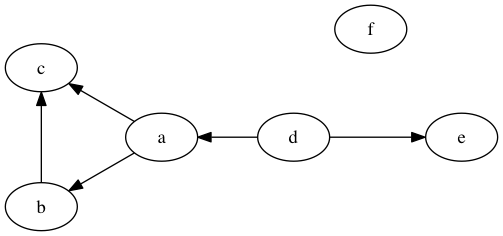

# Gliph

[](https://travis-ci.org/sdboyer/gliph)
[](https://packagist.org/packages/sdboyer/gliph)
[](https://coveralls.io/r/sdboyer/gliph?branch=master)

Gliph is a graph library for PHP. It provides graph building blocks and datastructures for use by other PHP applications. It is designed for use with in-memory graphs, not for interaction with a graph database like [Cayley](https://github.com/google/cayley) or [Neo4J](http://neo4j.org/) (though it could be used to facilitate such connection).

Gliph aims for both sane interfaces and as performant an implementation as userspace PHP allows.

This does require knowing enough about graphs to know what type is appropriate for your use case, but we are aiming to provide helpers that simplify those choices.

## Quickstart

Working with gliph is easy: pick a graph implementation, then add edges and vertices as needed. ()Note that gliph currently supports only object vertices, though this limitation may be loosened in future releases)

```php
<?php

use Gliph\Graph\DirectedAdjacencyList;

class Vertex {
    public $val;

    public function __construct($val) {
        $this->val = $val;
    }
}

$vertices = array(
    'a' => new Vertex('a'),
    'b' => new Vertex('b'),
    'c' => new Vertex('c'),
    'd' => new Vertex('d'),
    'e' => new Vertex('e'),
    'f' => new Vertex('f'),
);

$g = new DirectedAdjacencyList();

foreach ($vertices as $vertex) {
    $g->ensureVertex($vertex);
}

$g->ensureArc($vertices['a'], $vertices['b']);
$g->ensureArc($vertices['b'], $vertices['c']);
$g->ensureArc($vertices['a'], $vertices['c']);
$g->ensureArc($vertices['d'], $vertices['a']);
$g->ensureArc($vertices['d'], $vertices['e']);
```

This would create the following directed graph:



Once your graph is created, gliph provides a number of `Traversable` mechanisms for doing work on the graph. These mechanisms are important to understand and are explored in greater detail [in the wiki](https://github.com/sdboyer/gliph/wiki/Iterators), but for those familiar with graph theory, the method naming is intended to be self-explanatory:

For directed and undirected graphs:

* `Graph::vertices()`
* `Graph::edges()`
* `Graph::adjacentTo($vertex)`
* `Graph::incidentTo($vertex)`

And for directed graphs only:

* `Digraph::successorsOf($vertex)`
* `Digraph::predecessorsOf($vertex)`
* `Digraph::arcsFrom($vertex)`
* `Digraph::arcsTo($vertex)`

## Core Concepts

Gliph has several conceptual components that work together to create a coherent library: graph implementations, algorithms, and visitors.

Gliph has several components that work together: graph classes, algorithms, and visitors. Generally speaking, Gliph is patterned after the [C++ Boost Graph Library](http://www.boost.org/libs/graph/doc); reading their documentation can yield a lot of insight into how Gliph is intended to work.

### Graphs

Gliph’s most important baseline export is its assorted [graph interfaces](https://github.com/sdboyer/gliph/tree/master/src/Gliph/Graph). The other components (algorithms and visitors) rely **strictly** on the interfaces, never on concrete implementations. Consequently, users of gliph can craft case-specific implementations with the assurance that they will work with the algorithms. To assist towards that end, gliph provides phpunit testing traits that make it easy to ensure your custom graph implementations conform to both the letter and the spirit of gliph’s interfaces.

Gliph’s own implementations are designed to be as performant as possible for the general case. Current implementations include only adjacency lists, in both directed and undirected flavors.

### Algorithms

Gliph provides various algorithms that can be run on graph objects. These algorithms interact with the graph by making calls to methods, primarily the iterators, defined in the assorted Graph interfaces. If a graph implements the interface type-hinted by a particular algorithm, then the algorithm can run on that graph. But the efficiency of the algorithm will be largely determined by how efficiently that graph implementation can meet the requirements of the interface. Adjacency lists, for example, are not terribly efficient at providing a list of all edges in a graph, but are very good at single-vertex-centric operations.

Gliph's algorithms are typically implemented quite sparsely (especially traversers) - they seek to implement the simplest, most generic version of an algorithm. They also may not return any output, as that work is left to Visitors.

### Visitors

Most algorithms require a visitor object to be provided. The visitor conforms to an interface specified by the algorithm, and the algorithm will call the visitor at certain choice points during its execution. This allows the algorithms to stay highly generic, while visitors can be tailored to a more specific purpose.

For example, a ```DepthFirst``` visitor might be used to calculate vertex reach, or generate a topologically sorted list. Each of these are things that a depth-first graph traversal can do. But the work of doing so is left to the visitor so that only one traversal algorithm is needed, and that algorithm is as cheap (memory and cycles) as possible.

## Acknowledgements

This library draws inspiration from the [C++ Boost Graph Library](http://www.boost.org/libs/graph/doc), though has diverged in some significant design philosophies. Gliph generally follows the same patterns as [gogl](https://github.com/sdboyer/gogl), though the concepts are more rigorously applied there.

## License

MIT
